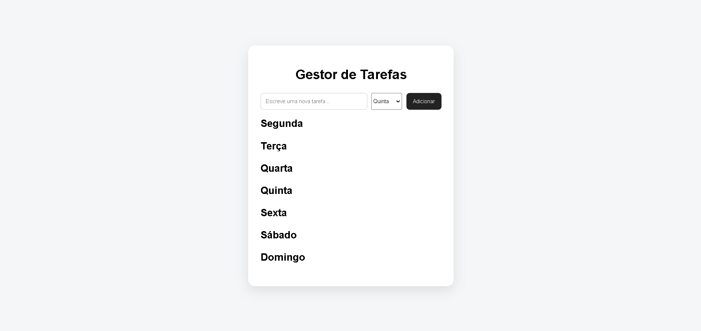
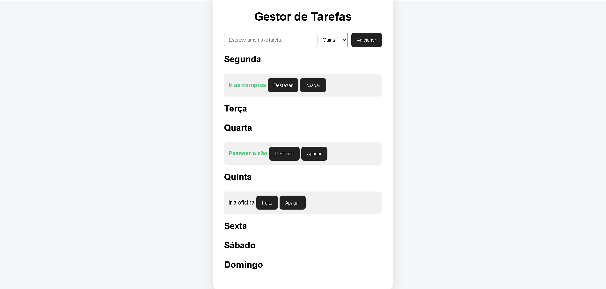
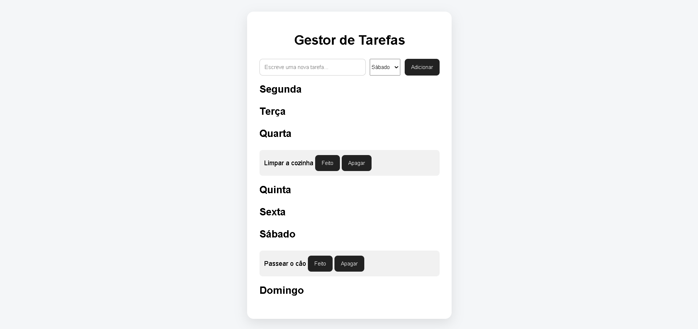

# 📋 Gestor de Tarefas Semanal

Aplicação Fullstack de gestão de tarefas desenvolvida com:

* Node.js
* Express
* MongoDB
* Mongoose
* HTML
* CSS
* JavaScript

O utilizador pode:

* adicionar tarefas
* organizar tarefas por dias da semana
* marcar tarefas como concluídas
* apagar tarefas

---

# 🚀 Tecnologias Utilizadas

## Backend

* Node.js
* Express
* MongoDB
* Mongoose

## Frontend

* HTML5
* CSS3
* JavaScript (Fetch API)

---

# 🧠 Funcionalidades

✅ Criar tarefas

✅ Organizar tarefas por dias da semana

✅ Marcar tarefas como concluídas

✅ Apagar tarefas

✅ Dados persistentes com MongoDB

✅ API REST completa

---

# 📂 Estrutura do Projeto

```bash
project/
│
├── models/
│   └── Task.js
│
├── routes/
│   └── tasks.js
│
├── public/
│   ├── index.html
│   ├── style.css
│   └── script.js
│
├── index.js
├── package.json
└── README.md
```

---

# 🔥 Endpoints da API

## GET /tasks

Lista todas as tarefas.

---

## POST /tasks

Cria uma nova tarefa.

### Exemplo:

```json
{
  "title": "Estudar Node.js",
  "day": "segunda"
}
```

---

## PUT /tasks/:id

Atualiza uma tarefa.

### Exemplo:

```json
{
  "completed": true
}
```

---

## DELETE /tasks/:id

Apaga uma tarefa.

---

# ⚙️ Como Executar o Projeto

## 1. Clonar o repositório

```bash
git clone URL_DO_REPOSITORIO
```

---

## 2. Entrar na pasta do projeto

```bash
cd task-api
```

---

## 3. Instalar dependências

```bash
npm install
```

---

## 4. Iniciar MongoDB

Garantir que o MongoDB está instalado e ativo.

---

## 5. Executar o servidor

```bash
node index.js
```

---

## 6. Abrir no navegador

```text
http://localhost:3000
```

---

# 🧩 Conceitos Aprendidos

* CRUD
* APIs REST
* Rotas com Express
* async/await
* MongoDB
* Mongoose
* Manipulação do DOM
* Fetch API
* Estruturação de projetos backend
* Comunicação entre frontend e backend

---

# 📸 Screenshots

## Página Principal



---

## Tarefa Concluída



---

## Organização Semanal



---

# 🎯 Melhorias Futuras

* Editar tarefas
* Sistema de prioridades
* Dark Mode
* Autenticação de utilizadores
* Drag and Drop
* Deploy online

---

# 👨‍💻 Autor

Santiago Fernandes

LinkedIn: adicionar_linkedin_aqui
GitHub: adicionar_github_aqui
